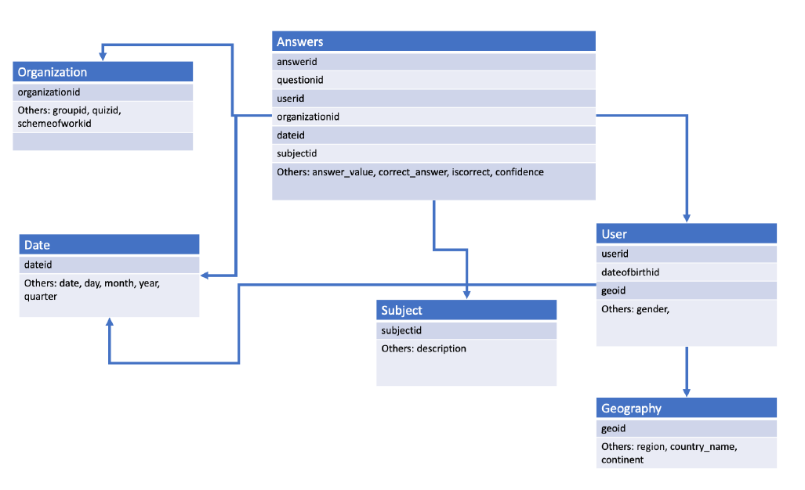

# Decision_Support_System
Laboratory of Data Science Project at @UniPi a.y. 2022/23

This repository contains the project for the *Laboratory of Data Science* course, which is divided into three main parts ([View the report](./LDS_FinalReport_group17.pdf):

- **Part 1: Database Creation and Population**  
   The first step in the Business Intelligence (BI) process involves creating and populating a database using SQL Server Management Studio. Starting from multiple files, the database schema was designed and implemented (as in Figure ).  

- **Part 2: Answering Business Questions using SSIS**  
   The objective of this phase is to address specific business questions related to the database created in the first part. This is achieved by using SQL Server Integration Services (SSIS) to develop client-side solutions (i.e., without using any SQL commands in the nodes, only standard SSIS components).

- **Part 3: Data Cube and MDX Queries**  
   In the final part of the project, a data cube is created on the previously prepared database using SQL Server Analysis Services (SSAS). The data cube construction is documented in the report, and business questions are answered using MultiDimensional eXpressions (MDX) in SQL Server Management Studio.
